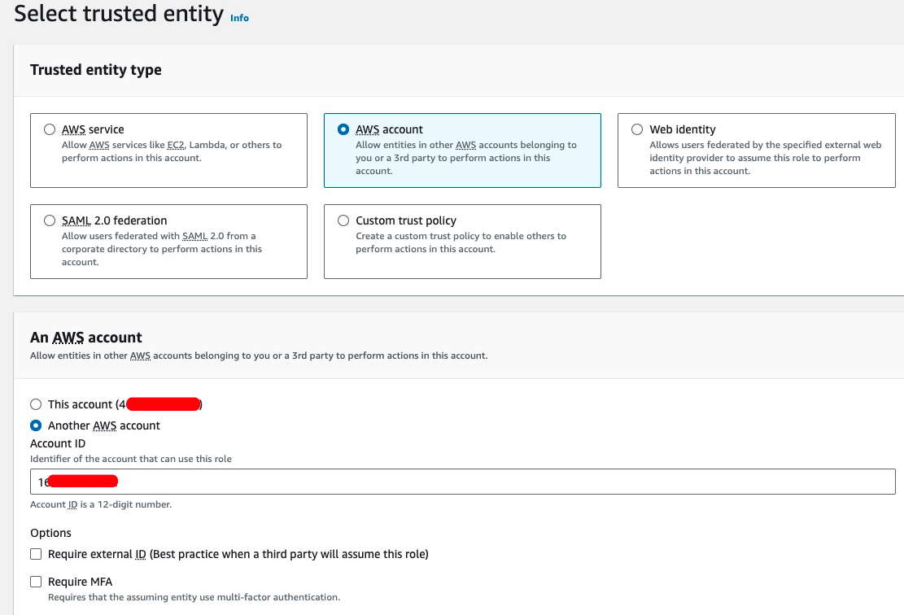
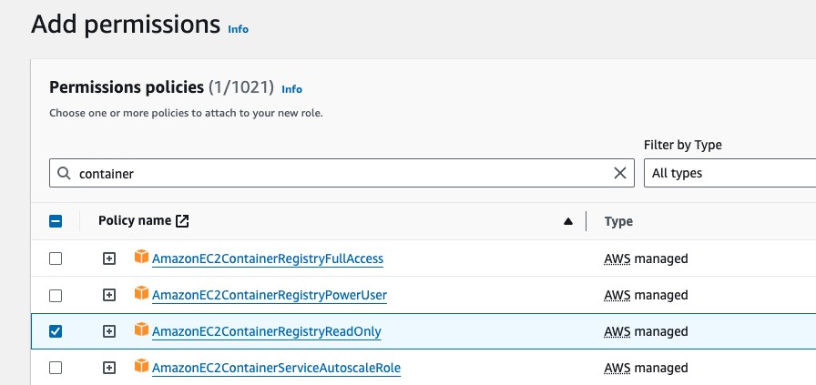
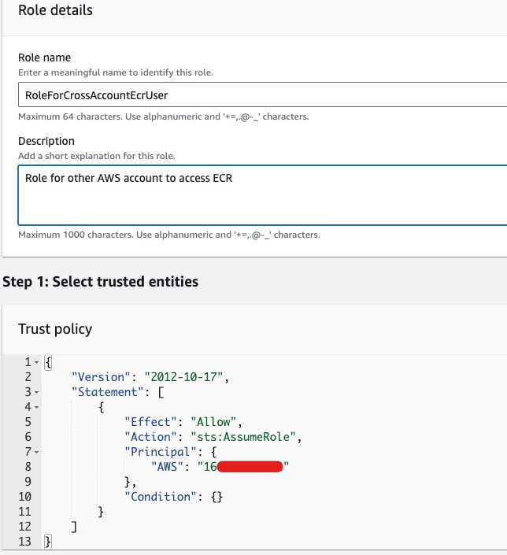
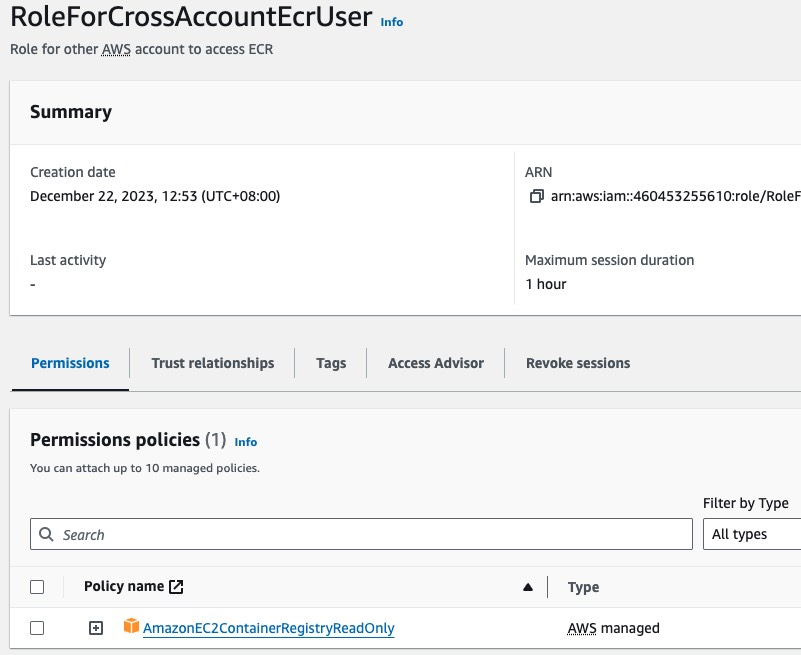
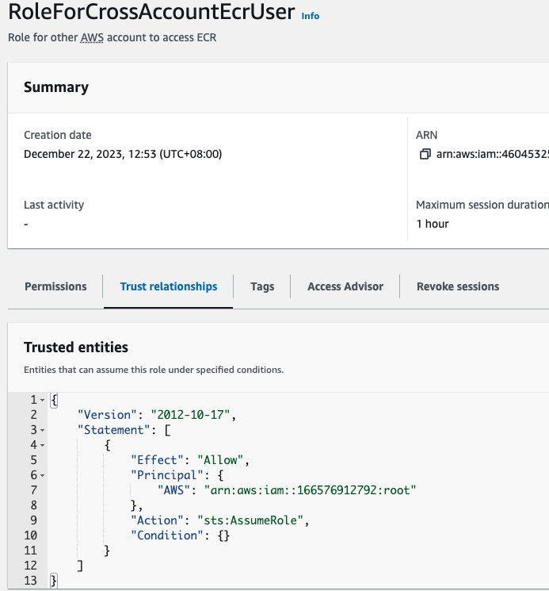
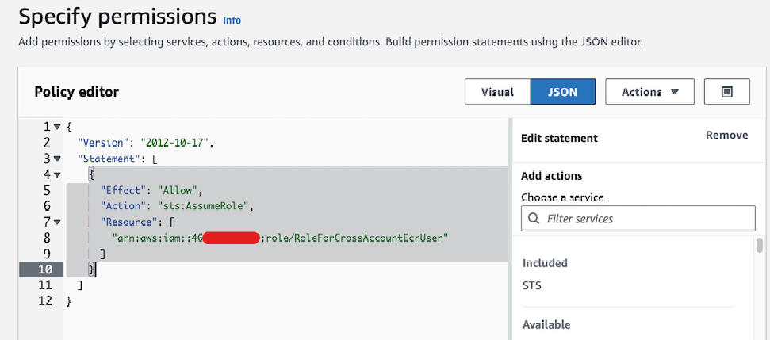
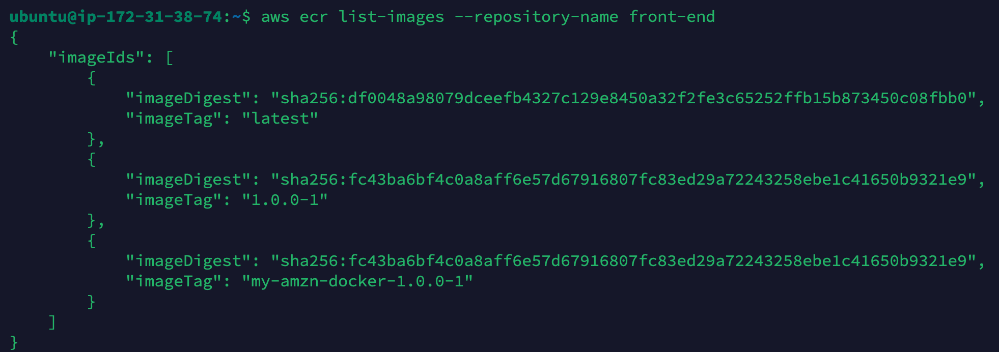

# Setup Cross-Account Access to ECR


We can grant cross-account access to ECR using resource policy or identity policy. Resource policy only allows single repository access. This tutorial shows how to grant access to all repositories using identity policy.

There are 2 accounts, account A which hosts the ECR repositories, and account B which uses the ECR repositories.

Overview of Steps:

1. In account A, create an IAM role in account A which can be assumed by account B.
2. In account B, assume the IAM role and perform operations on account A's ECR repositories.


### 1/ In Account A

1. In account A, create an IAM role which has access rights to ECR and can be assumed by account B. We must enter the account ID of account B.



2. Assign suitable ECR permissions to the role.



3. Give an name to the role, e.g. `RoleForCrossAccountEcrUser`. The Trust Policy will be automatically generated. 



4. Here is the created role in account A.





### 2/ In Account B

Assume we use EC2 in account B to pull ECR image from account A.

1. Assume the EC2 uses an IAM role `RoleToUseCrossAccountECR`. Edit its permissions to add an statement to assume the role `RoleForCrossAccountEcrUser` in account A, which was created in previous step.



2. In the terminal of EC2 instance, run following command to assume the role `RoleForCrossAccountEcrUser`, replace `ARN_OF_RoleForCrossAccountEcrUser` with its actual ARN value.
   * It extracts the `AWS_ACCESS_KEY_ID` and `AWS_SECRET_ACCESS_KEY` returned from `aws sts assume-role` command, and set them as environment variables.

```bash
export $(printf "AWS_ACCESS_KEY_ID=%s AWS_SECRET_ACCESS_KEY=%s AWS_SESSION_TOKEN=%s" $(aws sts assume-role --role-arn "ARN_OF_RoleForCrossAccountEcrUser" --role-session-name "ConsumingCrossAccountECR" --query "Credentials.[AccessKeyId,SecretAccessKey,SessionToken]" --output text))
```

3. Test using AWS CLI by listing images of an ECR repository in Account A. Replace `ECR_REPOSITORY_NAME` with actual value.

```
aws ecr list-images --repository-name ECR_REPOSITORY_NAME
```




### Others

EKS cluster cannot run `aws sts assume-role` command before pulling image. We can setup a cron job to refresh Access Key and Secret Access Key ID at fixed interval, and store them in AWS Secrets.

https://linuxhandbook.com/auto-update-aws-ecr-token-kubernetes/
